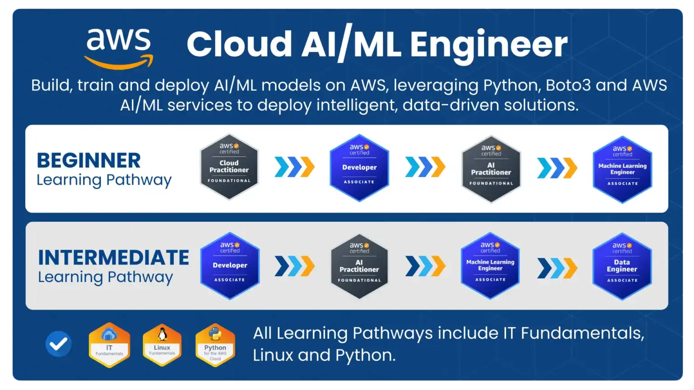

+++
title = "Welcome to My Cloud Journey"
date = 2026-01-22T16:00:00+01:00
draft = false
tags = ["cloud", "aws", "terraform", "certification"]
categories = ["updates"]
description = "Starting my cloud mastery journey with AWS and Terraform certifications in 2025"
+++

## A New Chapter Begins

Next week, I'm embarking on an exciting journey into cloud computing through the [Cloud Mastery Bootcamp](https://digitalcloud.training/cloud-mastery-bootcamp/) with Digital Cloud Training. 
I felt like it was time to get back on the "learn a new skill" path and while we're at it, let's choose something I consider fun : Cloud & DevOps

## 2025 Certs
I got 2 certs that made me want to continue
- Kubernetes and Cloud Native Associate (KCNA)
- AWS Cloud Practitioner

## 2025 Certification Goals

This year, I'm targeting four key certifications:

- **AWS Certified Solutions Architect Associate**
- **AWS Certified Developer Associate**
- **AWS Certified AI Practitioner**
- **Terraform Associate**

Welcome to my cloud journey. Let's see where this takes us.